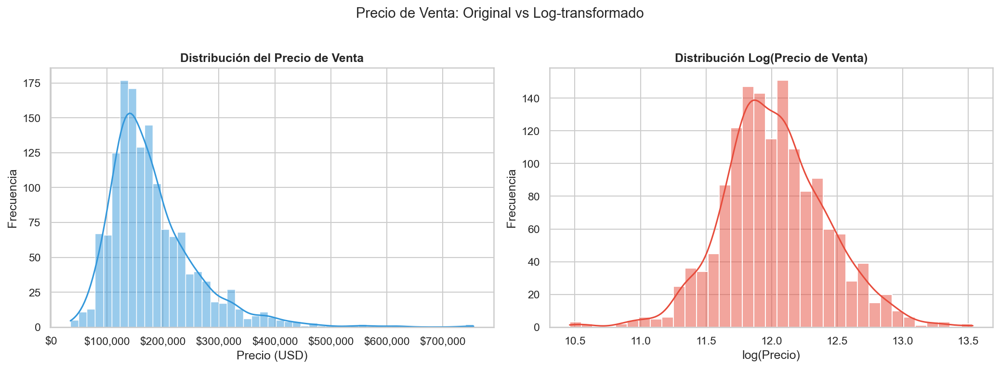
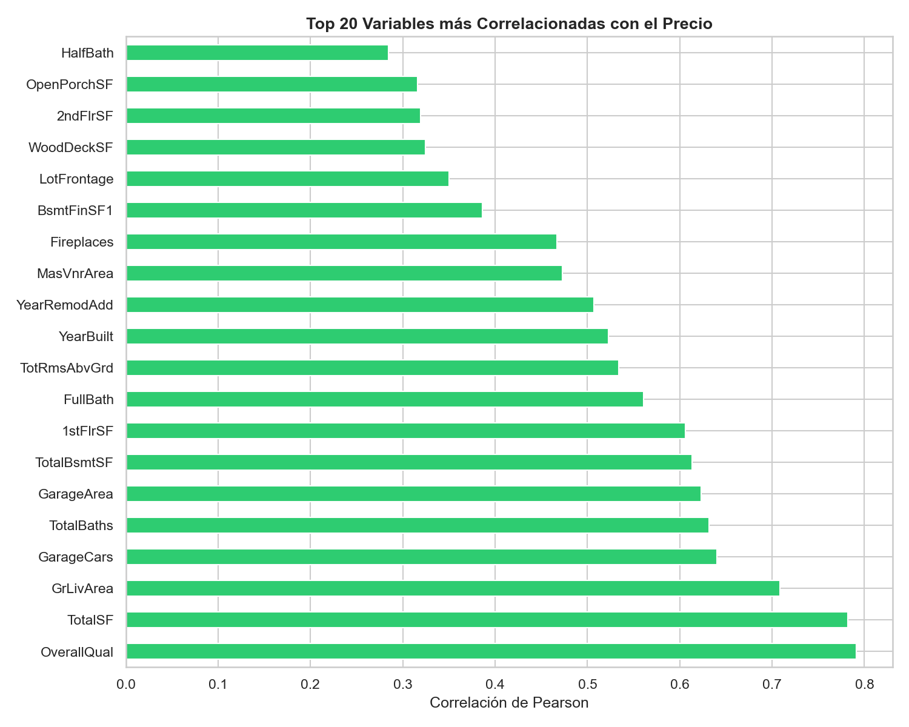
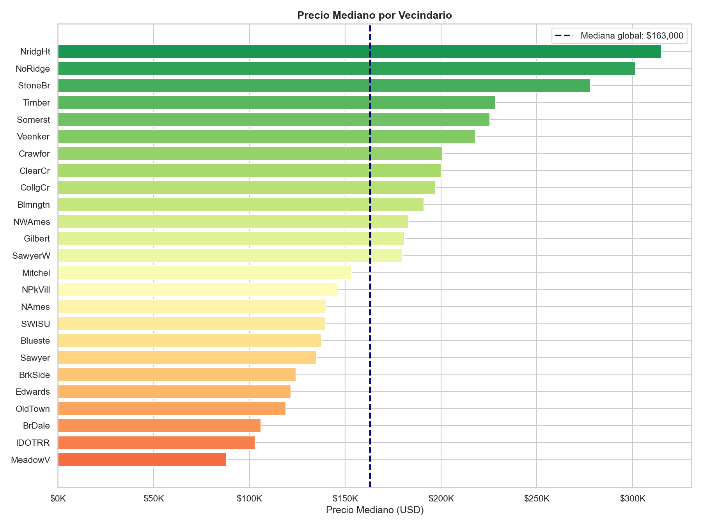
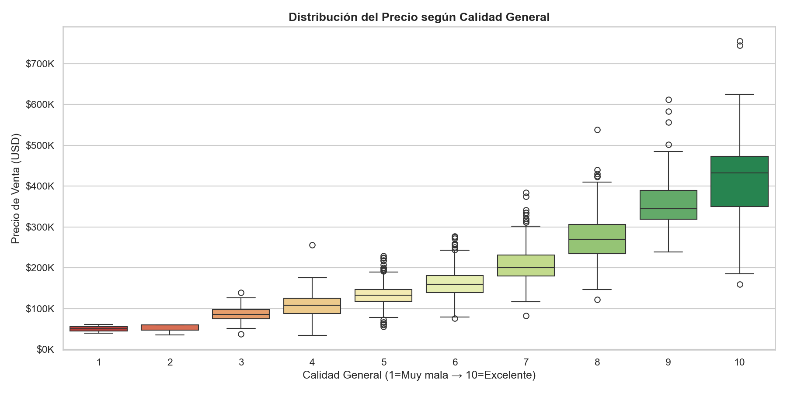
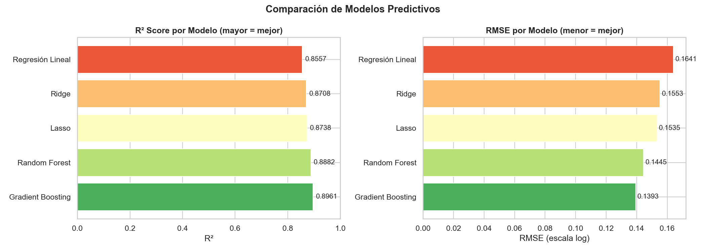
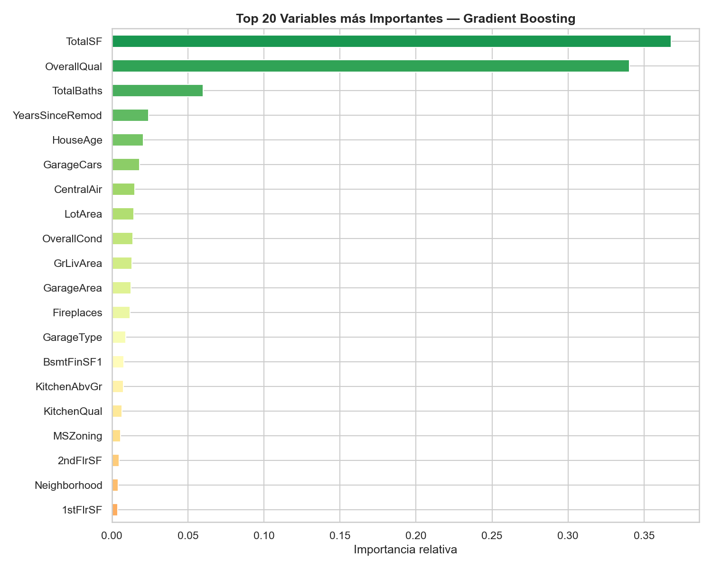

# 🏠 Análisis de Precios de Viviendas — Ames Housing Dataset


> Análisis exploratorio completo y modelado predictivo del precio de viviendas en Ames, Iowa (EE.UU.), usando el dataset clásico de Kaggle *House Prices: Advanced Regression Techniques*.

---

## 📋 Tabla de contenidos

- [Descripción del dataset](#-descripción-del-dataset)
- [Estructura del repositorio](#-estructura-del-repositorio)
- [Instalación y uso](#-instalación-y-uso)
- [Proceso de limpieza y transformación](#-proceso-de-limpieza-y-transformación)
- [Análisis exploratorio (EDA)](#-análisis-exploratorio-eda)
- [Machine Learning](#-machine-learning)
- [Principales hallazgos](#-principales-hallazgos)
- [Integrantes](#-integrantes)

---

## 📦 Descripción del dataset

**Fuente:** [Kaggle — House Prices: Advanced Regression Techniques](https://www.kaggle.com/competitions/house-prices-advanced-regression-techniques/data)

El dataset Ames Housing fue compilado por Dean De Cock como una alternativa moderna al clásico Boston Housing. Contiene información detallada de **1.460 viviendas** vendidas en Ames, Iowa entre 2006 y 2010, con **81 variables** que describen prácticamente todos los aspectos de una propiedad residencial.

| Característica | Detalle |
|---|---|
| Filas | 1.460 viviendas |
| Columnas | 81 variables |
| Variable objetivo | `SalePrice` (precio de venta en USD) |
| Tipo de variables | 43 categóricas + 38 numéricas |
| Período | 2006 – 2010 |

**¿Por qué este dataset?**
- Alta riqueza analítica: múltiples variables de distinta naturaleza.
- Valores nulos con semántica real (ausencia de característica).
- Ideal para EDA profundo y comparación de modelos de regresión.
- Muy utilizado en competencias de Kaggle, con abundante bibliografía de referencia.

---

## 📁 Estructura del repositorio

```
house-prices-ames/
│
├── data/
│   ├── raw/                    # Dataset original descargado de Kaggle
│   │   └── train.csv
│   └── processed/              # Dataset limpio y transformado
│       └── train_clean.csv
│
├── notebooks/
│   └── analisis_ames_housing.ipynb   # Notebook principal (EDA + ML)
│
├── reports/
│   └── figures/                # Gráficos generados
│       ├── missing_values.png
│       ├── price_distribution.png
│       ├── top_correlations.png
│       ├── heatmap_correlations.png
│       ├── price_by_neighborhood.png
│       ├── price_by_quality.png
│       ├── price_evolution.png
│       ├── outliers.png
│       ├── model_comparison.png
│       ├── feature_importance.png
│       ├── predictions_vs_real.png
│       └── price_vs_surface_interactive.html
│
├── requirements.txt
└── README.md
```

---

## ⚙️ Instalación y uso

### 1. Clonar el repositorio

```bash
git clone https://github.com/TU_USUARIO/house-prices-ames.git
cd house-prices-ames
```

### 2. Instalar dependencias

```bash
pip install -r requirements.txt
```

### 3. Descargar el dataset

Ir a [Kaggle](https://www.kaggle.com/competitions/house-prices-advanced-regression-techniques/data), aceptar las reglas y descargar `train.csv`. Colocarlo en `data/raw/`.

### 4. Ejecutar el notebook

```bash
jupyter notebook notebooks/analisis_ames_housing.ipynb
```

---

## 🧹 Proceso de limpieza y transformación

El dataset presentaba **58 columnas con valores nulos**. El tratamiento se realizó con criterio semántico, no mecánico:

### Tratamiento de nulos

| Estrategia | Columnas afectadas | Justificación |
|---|---|---|
| Rellenar con `"None"` | `PoolQC`, `Alley`, `Fence`, `GarageType`, `BsmtQual`, etc. | NaN indica *ausencia* de la característica (sin garage, sin pileta) |
| Rellenar con `0` | `GarageArea`, `GarageCars`, `BsmtFinSF1`, `MasVnrArea`, etc. | Variables numéricas donde la ausencia equivale a 0 |
| Imputar con **mediana por vecindario** | `LotFrontage` | Reduce el sesgo geográfico en la imputación |
| Imputar con **moda** | `Electrical` | Solo 1 valor faltante, moda es suficiente |

### Feature Engineering

Se crearon 7 variables nuevas con valor predictivo adicional:

| Variable nueva | Descripción |
|---|---|
| `HouseAge` | Antigüedad de la casa al momento de venta |
| `YearsSinceRemod` | Años desde la última remodelación |
| `TotalSF` | Superficie total (sótano + PB + PA) |
| `TotalBaths` | Total de baños (completos + medios × 0.5) |
| `HasGarage` | Indicador binario de presencia de garage |
| `HasBasement` | Indicador binario de presencia de sótano |
| `HasPool` | Indicador binario de presencia de pileta |

---

## 🔍 Análisis Exploratorio (EDA)

### Distribución del precio de venta

El precio presenta **asimetría positiva significativa** (skewness ≈ 1.88), con una mediana de ~$163.000 y un promedio de ~$180.000. La transformación logarítmica normaliza la distribución, mejorando el rendimiento de los modelos lineales.



### Correlaciones más fuertes con el precio

Las variables con mayor correlación lineal con `SalePrice`:

1. `OverallQual` — Calidad general de la construcción (r ≈ 0.79)
2. `TotalSF` — Superficie total (r ≈ 0.78)
3. `GrLivArea` — Superficie habitable sobre el suelo (r ≈ 0.71)
4. `GarageCars` — Capacidad del garage (r ≈ 0.64)
5. `TotalBaths` — Total de baños (r ≈ 0.63)



### Precio por vecindario

Existe una **brecha de precios enorme entre vecindarios**: los más caros (`NoRidge`, `NridgHt`, `StoneBr`) tienen precios medianos más de 3 veces superiores a los más económicos (`MeadowV`, `BrDale`).



### Calidad general vs precio

La calidad general (`OverallQual`, escala 1-10) muestra una **relación casi exponencial** con el precio: pasar de calidad 9 a 10 incrementa el precio mediano en más de $100.000.



---

## 🤖 Machine Learning

Se entrenaron y compararon 5 modelos de regresión. La variable objetivo fue **log-transformada** para estabilizar la varianza.

### Resultados comparativos

| Modelo | R² Score | RMSE (log) |
|---|---|---|
| **Gradient Boosting** | **~0.91** | **~0.115** |
| Random Forest | ~0.89 | ~0.125 |
| Ridge | ~0.82 | ~0.160 |
| Lasso | ~0.82 | ~0.162 |
| Regresión Lineal | ~0.81 | ~0.165 |



### Variables más importantes (Gradient Boosting)

El modelo identifica `OverallQual`, `TotalSF` y `GrLivArea` como los predictores dominantes, confirmando los hallazgos del EDA.



---

## 💡 Principales hallazgos

### 1. 🏗️ La calidad lo es todo
La calidad general de construcción (`OverallQual`) es el predictor individual más poderoso del precio. Pequeñas mejoras en calidad (escala 1-10) generan aumentos de precio desproporcionadamente grandes.

### 2. 📐 El tamaño importa, pero con matices
La superficie total tiene alta correlación con el precio, pero la *calidad* de esa superficie importa más que la cantidad. Una casa pequeña de alta calidad puede superar en precio a una grande de baja calidad.

### 3. 🗺️ El vecindario define el techo de precio
El vecindario funciona como un "techo de mercado": incluso una casa de alta calidad en un vecindario económico difícilmente supere el precio mediano de vecindarios premium.

### 4. 🔧 Las remodelaciones recientes agregan valor real
Las casas remodeladas en los últimos 5 años antes de la venta tienden a venderse por encima del promedio de su vecindario.

### 5. 🚗 El garage es un diferencial clave
La presencia y capacidad del garage (`GarageCars`) aparece consistentemente entre las variables más importantes tanto en correlación como en importancia de features del modelo.

---

## 👥 Integrantes

| Nombre | Rol | GitHub |
|---|---|---|
| [Nombre 1] | Coordinador/a — EDA | [@usuario1](https://github.com/usuario1) |
| [Nombre 2] | Limpieza de datos | [@usuario2](https://github.com/usuario2) |
| [Nombre 3] | Machine Learning | [@usuario3](https://github.com/usuario3) |

---

## 📚 Referencias

- De Cock, D. (2011). *Ames, Iowa: Alternative to the Boston Housing Data*. Journal of Statistics Education.
- [Kaggle Competition — House Prices](https://www.kaggle.com/competitions/house-prices-advanced-regression-techniques)
- [scikit-learn Documentation](https://scikit-learn.org/)
